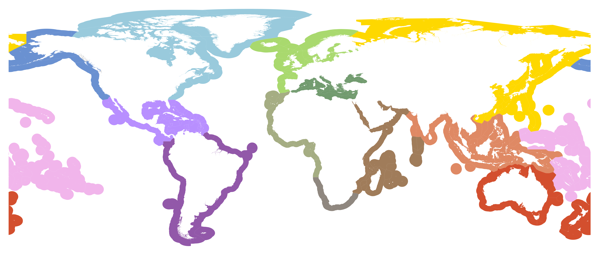

# hab-regions

This repository contains shapes for the IOC-UNESCO HAB regions.

### Sources

Hallegraeff, G., Bresnan, E., Enevoldsen, H., Schweibold, L. & Zingone, A. (2017). Call to Contribute to Global Harmful Algal Bloom Status Reporting. Harmful Algae News 58. 

Flanders Marine Institute (2018). The intersect of the Exclusive Economic Zones and IHO sea areas, version 3. Available online at http://www.marineregions.org/. https://doi.org/10.14284/324